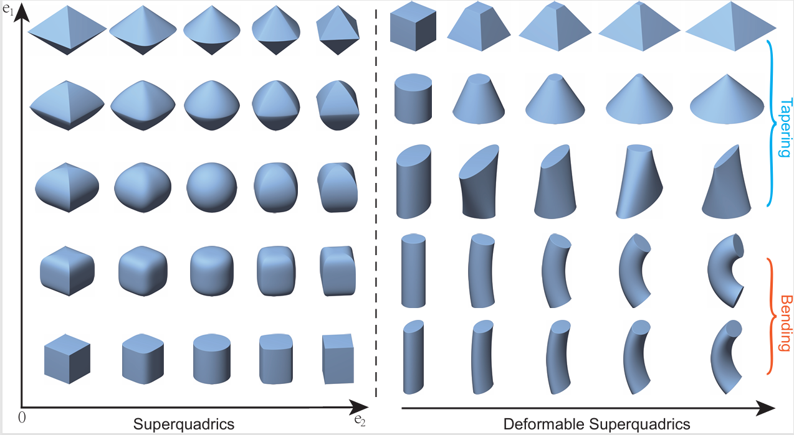

# A Holistic Method for Superquadric Fitting Using Unsupervised Clustering Analysis (TPAMI 2026)

## Background 
Fitting geometric primitives to 3D point clouds serves as a critical bridge between low-level scattered data and high-level structural representations of underlying 3D
shapes. As a powerful modeling primitive, superquadratic surfaces (superquadrics) extend traditional CAD models (e.g., cylinders, spheres) with great flexibility and versatility. These surfaces encompass a rich shape vocabulary, ranging from cuboids, ellipsoids, and octahedra to their intermediate forms (the left panel of Fig. 1), encoded with only five parameters in canonical form. Additionally, their modeling power can be further expanded via global deformations, such as tapering or bending, enabling the description of more complex geometries that transcend standard primitives (the right panel of Fig. 1). 

**Please give a star and cite if you find this repo useful.**



## This Work

We provide a holistic method for superquadric fitting including both rigid and deformable shapes from clustering perspective. 


## Implementation
- For convenience, the repository provides **MATLAB** and **Python** implementations. 


## MATLAB 
```
- Step 1: Download the directory **"matlab_version"**, which contains random superquadric point generation, initialization, and fitting process.
- Step 2: Start MATLAB and run **"test_main.m"** for rigid superquadric fitting or **"test_main_deform.m"** for deformable sueprquadric fitting. This will give you an immediate fitting result for the test point cloud data generated randomly.
```

### Todo 
A Python version is coming soon !


## Contact 
If you have any problem, please contact us via <zhaomingyang@amss.ac.cn>. We greatly appreciate everyone's feedback and insights. Please do not hesitate to get in touch!


## Acknowledgement
We would like to thank and acknowledge referenced codes from [EMS: A probabilistic approach for superquadric recovery](https://github.com/bmlklwx/EMS-superquadric_fitting).


<!--
## Citation
Please consider citing our work if you find it useful:

```bibtex
@inproceedings{zhao2026clustereg,
  title={Correspondence-Free Nonrigid Point Set Registration Using Unsupervised Clustering Analysis},
  author={Mingyang Zhao, Jingen Jiang, Lei Ma, Shiqing Xin, Gaofeng Meng, Dong-Ming Yan},
  booktitle={Proceedings of the IEEE/CVF Conference on Computer Vision and Pattern Recognition},
  year={2024}
}
```
-->
